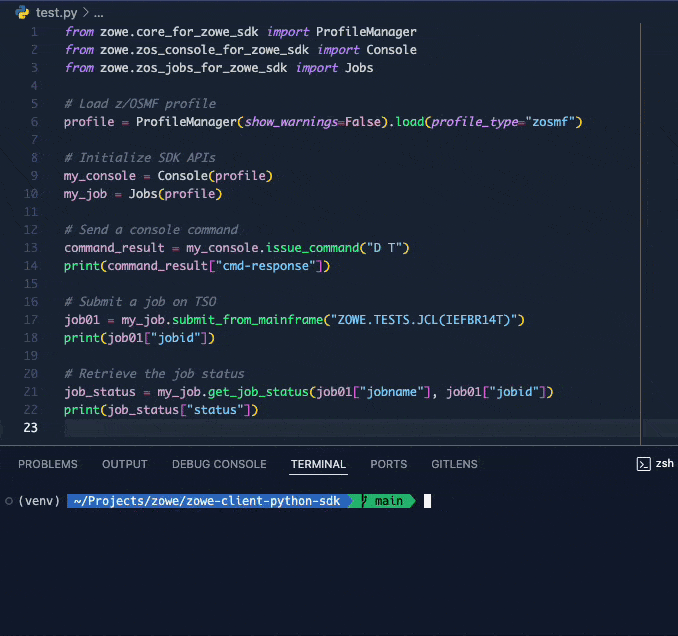

# Zowe Python Client SDK

 

[](https://zowe-client-python-sdk.readthedocs.io/en/latest/?badge=latest)

The Zowe Python Client SDK is an open-source Python package for z/OSMF REST API. It allows you to leverage mainframe capabilities from your Python programs with minimum effort.



# Requirements

```
requests-2.22
keyring
pyyaml
```

# Quickstart

Start by importing the **ZoweSDK** class and create an object that will be the handler for all z/OSMF requests. The SDK supports both manual authentication and Zowe CLI z/OSMF profile.

```python
from zowe_sdk import ZoweSDK

z = ZoweSDK(zosmf_host='<host address>', zosmf_user='<zosmf user>', zosmf_password='<zosmf password>')
```

To use a Zowe CLI z/OSMF profile, simply inform the profile name while creating the object.

```python
from zowe_sdk import ZoweSDK

z = ZoweSDK(zosmf_profile='<profile name>')
```

**Important**: If your z/OSMF profile uses a credentials manager, this approach may not work depending on your operating system. Support for loading secure profiles has only been tested on Windows and Ubuntu so far.


# Available options

Currently, the Zowe Python SDK supports the following interfaces:

* Console commands
* z/OSMF Information retrieval
* Submit job from a dataset
* Submit job from local file
* Submit job as plain text JCL
* Retrieve job status
* Retrieve job list from JES spool
* Start/End TSO address space
* Ping TSO address space
* Issue TSO command

## Console

Usage of the console api
```python
result = z.console.issue_command("<command>")
```
The result will be a JSON object containing the result from z/OSMF

## Job

To retrieve the status of a job on JES
```python
result = z.jobs.get_job_status("<jobname>", "<jobid>")
```

To retrieve list of jobs in JES spool
```python
result = z.jobs.list_jobs(owner="<user>", prefix="<job-prefix>")
```
Additional parameters available are:

* max_jobs
* user_correlator

To submit a job from a dataset:
```python
result = z.jobs.submit_from_mainframe("<dataset-name>")
```

To submit a job from a local file:
```python
result = z.jobs.submit_from_local_file("<file-path>")
```

To submit from plain text:
```python
jcl = '''
//IEFBR14Q JOB (AUTOMATION),CLASS=A,MSGCLASS=0,
//             MSGLEVEL=(1,1),REGION=0M,NOTIFY=&SYSUID
//STEP1    EXEC PGM=IEFBR14
'''

result = z.jobs.submit_from_plaintext(jcl)

```

## TSO

Starting a TSO address space
```python

session_parameters = {
     'proc': 'IZUFPROC',
     'chset': '697',
     'cpage': '1047',
     'rows': '204',
     'cols': '160',
     'rsize': '4096',
     'acct': 'DEFAULT'
}

session_key = z.tso.start_tso_session(**session_parameters)
```
If you don't provide any session parameter ZoweSDK will attempt to start a session with default parameters.

To end a TSO address space
```python
z.tso.end_tso_session("<session-key>")
```

In order to issue a TSO command
```python
tso_output  =  z.tso.issue_command("<tso-command>")
```

## z/OSMF
Usage of the z/OSMF api
```python
result = z.zosmf.get_info()
```
The result will be a JSON object containing z/OSMF information


# Acknowledgments

* Make sure to check out the [Zowe project](https://github.com/zowe)!
* For further information on z/OSMF REST API, click [HERE](https://www.ibm.com/support/knowledgecenter/SSLTBW_2.1.0/com.ibm.zos.v2r1.izua700/IZUHPINFO_RESTServices.htm)